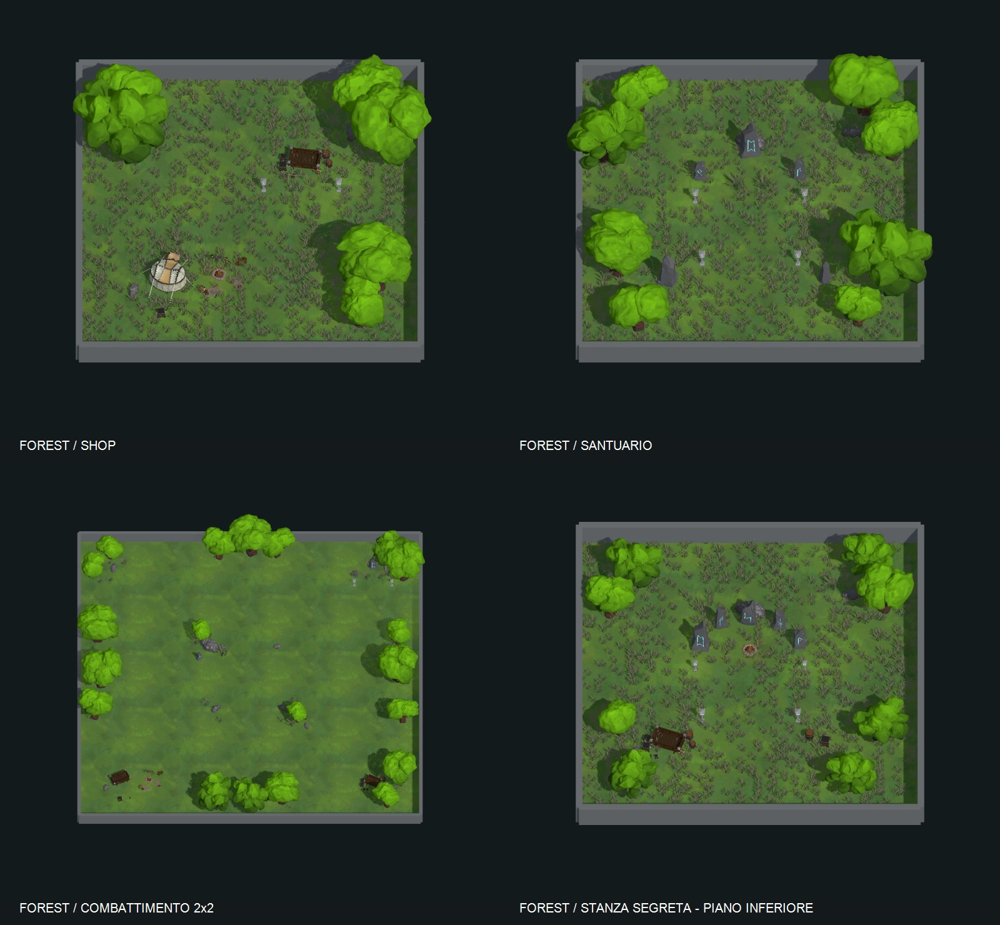

# Arredo stanze Forest — 7 settembre 2026

Completati i 56 prefab Forest che erano privi di arredi, usando solo istanze degli asset esistenti. Conservati integralmente i 5 esempi: Start, tre Combat 1x1 e Combat 1x2 variante 1.

Gli arredi sono raccolti nei gruppi `Forest_Decor` dentro ogni prefab. Nei SecretAccess ci sono gruppi distinti sotto `Normal` e `Secret`, rispettando il dislivello di 25 metri. I prefab si trovano in `Assets/_Project/Data/Database/Floor/Floors/1 Floor/Forest/Rooms/`.

- **Combat:** accampamenti, carri di scorte, pietre runiche e piccoli boschetti nelle stanze grandi.
- **Boss, Miniboss, Challenge:** alberi e segnalazioni ai bordi, con radure aperte per gli incontri.
- **Shop, NpcEncounter:** tende, carri, provviste, fuochi, pozzi e lanterne.
- **Karma:** santuari di pietre runiche, con composizioni diverse per Curch ed EvilCurch.
- **Treasure:** arredi attorno al forziere esistente e scorte laterali.
- **Parkour:** arredo perimetrale e riferimenti visivi; mantenuto lo switch esistente.
- **SecretAccess:** indizi in superficie e depositi/santuari al piano inferiore.

Totale: **3.955 istanze** da **26 prefab sorgente**, distribuite su 56 stanze e 64 livelli arredati. Gli altri temi non sono inclusi in questo passaggio.

## Verifica

- Salvataggio, reimportazione e rendering tramite Unity **2022.3.62f3**, URP del progetto.
- 64 anteprime prodotte; panoramiche e dettagli rappresentativi ispezionati. Sacchi dai colori viola sostituiti con casse neutre; rune orientate verso l'accesso.
- **3.955** appoggi al terreno verificati, **0** anomalie di quota e **0** riferimenti obbligatori mancanti negli arredi.
- Confronto NavMesh prima/dopo su **13 stanze**, **74 percorsi** completi, **0** regressioni. Inclusi tutti i prefab segnalati dal controllo conservativo delle chiome vicino alle porte. Il confronto usa agente 0, RenderMeshes e layer mask 243 del progetto, con porte aperte solo nelle istanze temporanee.
- Confronto dei blocchi YAML: tutti gli oggetti/componenti originali conservati; ammesse solo aggiunte alla gerarchia. Invariati GUID, 5 prefab di riferimento e tutti i **65 asset Forest** controllati, compresi terreni e dati.
- Gli strumenti Editor temporanei sono stati rimossi dopo la verifica. Nessuno script di gameplay, materiale sorgente, scena, pacchetto o impostazione del progetto modificato.
- Compilazione finale dopo la rimozione degli strumenti: Unity termina con codice **0**, nessun errore C# (`Logs/ForestFurnishing-CleanCompile.log`). `git diff --check` segnala soltanto spazi finali nella serializzazione di blocchi Unity; il confronto strutturale conferma la conservazione dei componenti originali.

Non eseguiti una partita in Play Mode, un build giocabile o misurazioni di prestazioni. Il test NavMesh verifica la geometria, non l'intero ciclo degli incontri o delle interazioni.

Evidenze locali, ignorate da Git: `Logs/ForestFurnishing/validation.txt`, `navigation.txt`, `preservation-verification.json`, `after/`, `polish.txt` e `Logs/ForestFurnishing-Final.log`. Le copie degli strumenti usati sono conservate nella stessa cartella Logs.
